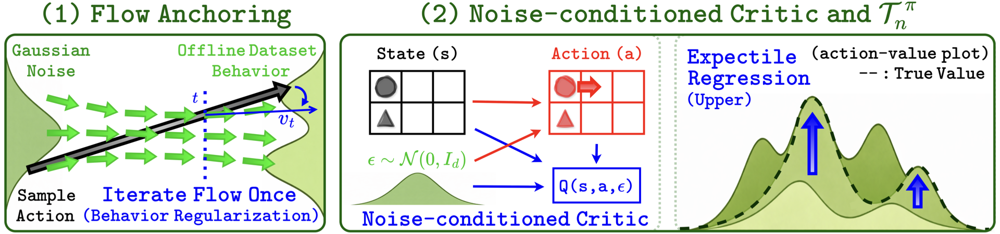

<div align="center">

<div id="user-content-toc" style="margin-bottom: 50px">
  <ul align="center" style="list-style: none;">
    <summary>
      <h1 style="font-size:1.76rem">
        Flow-Anchored Noise-conditioned Q-Learning (FAN)
      </h1>
    </summary>
  </ul>
</div>


</div>

## TL;DR

FAN achieves SOTA offline RL performance while overcoming the high costs of flow policies and distributional critics. This success is attributed to (1) Flow Anchoring and (2) Noise-conditioned Q-Learning. [Blog (ICML'26)](https://brianlsy98.github.io/posts/fan/)

## Installation

1. Create an Anaconda environment
   ```
   conda create -n fan python=3.10.13 -y
   ```
2. Activate the environment:
   ```
   conda activate fan
   ```
3. Install the dependencies:
   ```
   conda install -c conda-forge glew -y
   conda install -c conda-forge mesalib -y
   conda install -c conda-forge patchelf -y
   pip install -r requirements.txt
   ```
3. Setup `MuJoCo 2.1.0` for D4RL environments
   ```
   mkdir ~/.mujoco
   cd ~/.mujoco
   wget https://roboti.us/file/mjkey.txt
   wget https://github.com/google-deepmind/mujoco/releases/download/2.1.0/mujoco210-linux-x86_64.tar.gz
   tar -xvzf mujoco210-linux-x86_64.tar.gz
   rm mujoco210-linux-x86_64.tar.gz
   ```
4. Export environment variables
   ```
   export LD_LIBRARY_PATH=$LD_LIBRARY_PATH:/usr/lib/nvidia:$HOME/.mujoco/mujoco210/bin
   export PYTHONPATH=path_to_fan_dir
   export MUJOCO_GL=egl
   export PYOPENGL_PLATFORM=egl
   ```

## Running experiments

The `agents` folder contains the implementation of our algorithm FAN, and three other variants for our ablation studies (NBRAC, NFQL, FAQL). Here are some example commands to run experiments:

```
# FAN on OGBench scene-play
bash bash_scripts/scene/fan.sh

# FAN on D4RL adroit
bash bash_scripts/d4rl-adroit/fan.sh

# FAN on OGBench visual-cube-double-play
bash bash_scripts/visual-cube-double/fan.sh
```

The hyperparameters in each bash file represent the default hyperparameters.

## Computational Efficiency Measurement

The `compute_efficiency.py` file contains the implementation of our measurement of the number of floating point operations (FLOPs) and runtime. Measurements are performed for a single training/inference step.

First, include the baseline code of interest in the `agents` folder. Second, modify the AGENTS list in the `compute_efficiency.py` file. Then, run:
```
python compute_efficiency.py
```

## Acknowledgments

This codebase is adapted from the [OGBench](https://github.com/seohongpark/ogbench), [FQL](https://github.com/seohongpark/fql), and [Value Flows](https://github.com/chongyi-zheng/value-flows) implementations.
